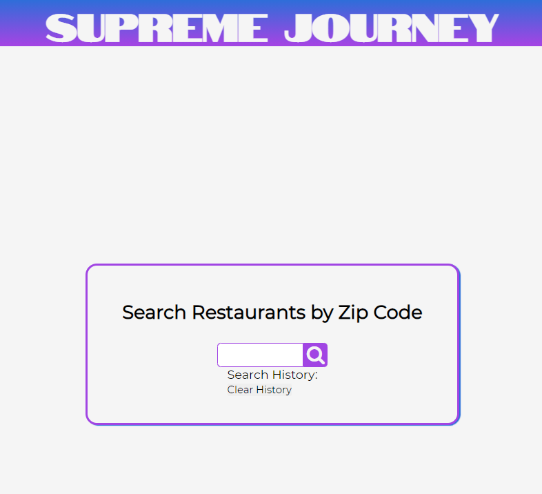
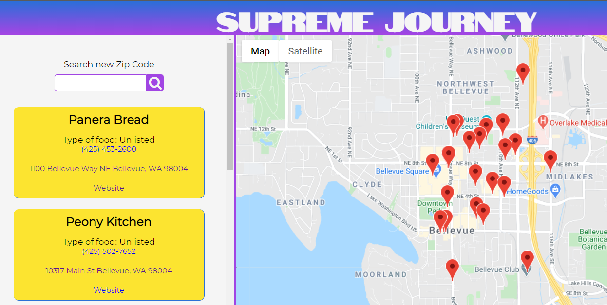

# supreme-journey

## About

Supreme Journey is about creating a simple way to find a website. Upon landing on the first page you are greeted with a simple request to enter a zip code to find restaurants in that area. The search results page shows the user local restaurants along with a map of where the restaurants are located. Hovering over the restaurant card will cause the corresponding marker to bounce and clicking on the card will load the card info on the map. The links are clickable and will open in a new tab. 

## Submission Links
Repository URL: [https://github.com/JosephCordell/supreme-journey](https://github.com/JosephCordell/supreme-journey)

Website URL: [https://josephcordell.github.io/supreme-journey/](https://josephcordell.github.io/supreme-journey/)

## Screenshots

### Resources 
- DocuMenu API
- Google Maps API
- Font Awesome
